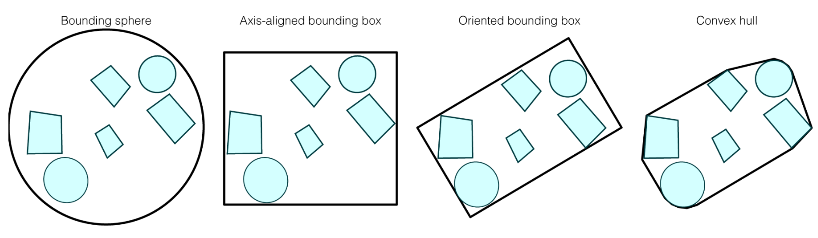

# Object Partitioning vs. Space Partitioning Schemes

Object partitioning schemes are to bound objects into a big collection (box, sphere, convex hull) so that we can quickly query the data structure. The space can be shared within multiple bounding.

Space partitioning schemes are to divide the space into subspaces. 

# Types of Bounding boxes

## Axis Aligned Bounding Box
Consider a 2D example, an AABB is defined by 4 lines 
$$x = x_{min}, x = x_{max}, y=y_{min}, y=y_{max}$$
where the point is within the bounding box if  
$$(x, y) \in [x_{min}, x_{max}]\times[y_{min}, y_{max}]$$

Easy to build, but waste a lot of areas

## Sphere
For a group of objects $A_1,...,A_n$, let the 
$$c = \sum_{i=1}^n \frac{A_i}{n}, r = \max\{\|A_i - c\|\}$$
However, note that intersecting with a sphere involves solving a quadratic equation hence more computations. Also, it wastes a lot of areas

## Oriented Bounding box
For a group of objects $A_1,..., A_n$, do PCA so that we can take the first 2 largest principal components, and make it our axis. 

Little area wasted, but computations for interactions and constructions

## Convex Hull
No area wasted, but takes much computations for constructing such trees.

# Axis Aligned Bounding Box Tree


## Intersecting an AABB
for a ray $e+td$, it can intersect with the 4 lines as 
$$t_{xmin}=(x_{min} - x_e)/x_d, t_{xmax}=(x_{max} - x_e)/x_d$$
$$t_{ymin}=(y_{min} - y_e)/x_d, t_{ymax}=(y_{max} - y_e)/x_d$$
and an intersection happens if 
$$[t_{xmin}, t_{xmax}]\cap [t_{ymin}, t_{ymax}]\neq \emptyset\Rightarrow \exists t > 0. e+td \in  [x_{min}, x_{max}]\times[y_{min}, y_{max}]$$

For the actual implementation, notice that if $d_x < 0$, then $t_{xmin} < t_{xmax}$ so that we need one if check.  

Also, note that $d_x=0$ will lead to divide by 0 error and $t_{xmin}=t_{xmax} = \infty$, so we use $a_x = d_x^{-1}$ to handle such case so that for each coordinate we check 
``` python
a = 1 / x_d
if a >= 0:
    t_xmin = a * (x_min - x_e)
    t_xmax = a * (x_max - x_e)
else:
    t_xmax = a * (x_min - x_e)
    t_xmin = a * (x_max - x_e)
```


```python
abc = np.array([0, .4, .2])
ghi = np.array([0, .5, .2])
abc.dot(np.cross(abc, ghi))
```


    0.0


```python
import numpy as np
import matplotlib.pyplot as plt

class Triangle(Object):
    def __init__(self, corners):
        """ corners is a 3 * 3 list of list 
        each row is a corner
        """
        self.corners = np.array(corners)
    
    def intersect(self, ray_d, ray_e, min_t, max_t):
        abc = self.corners[0] - self.corners[1]
        def_ = self.corners[0] - self.corners[2]
        ghi = ray_d
        jkl = self.corners[0] - ray_e
        
        M = abc.dot(np.cross(def_, ghi))
        time = - def_.dot(np.cross(abc, jkl)) / M
        
        if time < min_t or time > max_t:
            return - np.inf
        gamma = ghi.dot(np.cross(abc, jkl)) / M
        if gamma < 0 or gamma > 1:
            return - np.inf
        beta = jkl.dot(np.cross(def_, ghi)) / M
        if beta < 0 or beta > 1:
            return - np.inf
        if beta + gamma > 1:
            return - np.inf
        return time
    
    
class BoundingBox:
    def __init__(self):
        self.min_corner = -np.array(np.inf, np.inf, np.inf)
        self.max_corner = np.array(np.inf, np.inf, np.inf)
        
    def __init__(self, min_corner, max_corner):
        self.min_corner = np.array(min_corner)
        self.max_corner = np.array(max_corner)
        
    def intersect(self, ray_d, ray_e, min_t, max_t):
        a = 1 / ray_d
        diff_min = self.min_corner - ray_e
        diff_max = self.max_corner - ray_e
        t_xmin = a[0] * diff_min[0] if a[0] >= 0 else a[0] * diff_max[0]
        t_xmax = a[0] * diff_max[0] if a[0] >= 0 else a[0] * diff_min[0]
        t_ymin = a[1] * diff_min[1] if a[1] >= 0 else a[1] * diff_max[1]
        t_ymax = a[1] * diff_max[1] if a[1] >= 0 else a[1] * diff_min[1]
        t_zmin = a[2] * diff_min[2] if a[2] >= 0 else a[2] * diff_max[2]
        t_zmax = a[2] * diff_max[2] if a[2] >= 0 else a[2] * diff_min[2]
        if t_xminn > t_ymax or t_ymin> t_xmax \
            or t_xmin > t_zmax or t_zmin > t_xmax \
            or t_zmin > t_ymax or t_ymin > t_zmax:
            return False
        return t_max > max(t_xmax, t_ymax, t_zmax) \ 
            and t_min < max(t_xmin, t_ymin, t_zmin)
    
    def insert(self, obj):
        if isinstance(obj, BoundingBox):
            self.min_corner = np.min(np.vstack((self.min_corner, obj.min_corner)), axis=0)
            self.max_corner = np.max(np.vstack((self.max_corner, obj.max_corner)), axis=0)
        if isinstance(obj, Triangle):
            self.min_corner = np.min(np.concatenate((self.min_corner[np.newaxis, :], 
                                                     obj.corners), axis=0),
                                     axis=0)
            self.max_corner = np.max(np.concatenate((self.max_corner[np.newaxis, :], 
                                                     obj.corners), axis=0),
                                     axis=0)
            
    def center(self):
        return (self.min_corner + self.max_corner) / 2
```

## AABB Tree
An AABB tree is constructed recursively, at each level, it is the bounding box that encloses all the item, and it further divide into subtrees, each subtree will have a smaller bounding box. 

AABB tree will have bounding box overlapping.


```python
class AABBTree:
    """ An AABB Tree
    box:   (BoundingBox) the bounding box that contains all the items
    left:  (AABBTree) the left subtree
    right: (AABBTree) the right subtree
    """
    self.box = None
    self.left = None
    self.right = None
    def __init__(self, objs):
        
        # base case, if this is the leaf node
        if len(objs) == 1:
            self.box = obj
            return
        
        # insert all objects into the top level bounding box
        self.box = BoundingBox()
        for obj in objs:
            self.box.insert(obj)
        
        # determine the axis split
        axis = np.argmax(self.box.max_corner - self.box.min_corner)
        left, right = [], []
        for obj in objs:
            if obj.center()[axis] < self.center()[axis]:
                left.append(obj)
            else:
                right.append(obj)
        
        # do a random split if all items are in one side
        if (len(left) == 0) != (len(right) == 0):
            left, right = [], []
            curr = 0
            for obj in objs:
                if curr % 2 == 1:
                    left.append(obj)
                else:
                    right.append(obj)
                curr += 1
        # recursively build the subtrees
        if len(left) > 0:
            self.left = AABBTree(left)
        if len(right) > 0:
            self.right = AABBTree(right)
            
    def intersect(self, ray_d, ray_e, min_t):
        
        # base case 1: if this is the leaf
        if isinstance(self.box, Triangle):
            return self.box.intersect(ray_d, ray_e, min_t)
        # base case 2: if this is not the leaf
        if isinstance(self.box, BoundingBox) and not self.box.intersect(ray_d, ray_e, min_t):
            return -np.inf
        
        # recursive call
        if self.left is not None:
            t_left = self.left.intersect(ray_d, ray_e, min_t, max_t)
        if self.right is not None:
            t_right = self.right.intersect(ray_d, ray_e, min_t, max_t)
        if t_left > - np.inf and t_right > - np.inf:
            return min(t_left, t_right)
        else:
            return max(t_left, t_right)
```

## Distancing Using BFS

<a href="https://lihd1003.github.io/UofT-Course-Material-Repo/CSC265%20Enriched%20Data%20Structures%20and%20Analysis/NOTE/10.BFS_and_DFS.pdf">BFS Notes</a>


```python
class Point:
    def __init__(self, p):
        self.p = np.array(p)
    
    def distance(self, q):
        return np.sum((p - q) ** 2)
    
    
class PriorityQueue:
    """ A poor priority queue implementation
    """
    def __init__(self):
        self.items = []
        self.priorities = []
    
    def append(self, priority, item):
        self.items.append(item)
        self.priorities.append(priority)
    
    def __len__(self):
        return len(self.items)
    
    def dequeue(self):
        max_p = max(self.priorities)
        for i in range(len(self.items)):
            if self.priorities[i] == max_p:
                return self.priorities.pop(i), self.items.pop(i)
        
def point_box_sqrd(q, box):
    """ Measures the squared distance between
    a query point p and a bounding box
    """
    d = np.max(np.vstack((box.min_corner - q, q - box.max_corner)), axis=0)
    return np.sum(d * d)

def point_AABBTree_sqrd(q, root):
    """ Measures the squared distance between
    a query point p and an AABBTree
    """
    pq = PriorityQueue()
    
    # bfs
    pq.append(point_box_sqrd(q, root.box), root)
    sqrd = max_sqrd + 1
    
    while len(pq) > 0:
        curr_prio, curr_item = pq.dequeue()
        if curr_prio < sqrd:
            # if is a leaf
            if isinstance(curr_item.box, Point):
                new_sqrd = curr_item.box.distance(q)
                sqrd = new_sqrd if new_sqrd < sqrd else sqrd
            else:
                if curr_item.left is not None:
                    pq.append(point_box_sqrd(q, curr_item.left.box), curr_item.left)
                if curr_item.right is not None:
                    pq.append(point_box_sqrd(q, curr_item.right.box), curr_item.right)
    return sqrd
```
