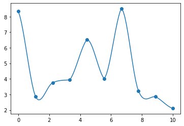

```python
import numpy as np
import matplotlib.pyplot as plt
```

# Bone
A bone is a UI widget for visualizing and controlling a 3D rigid transformation. 

## Canonical Bone
A canonical bone of length $l$ lies across the x-axis is two points: the tail $(0, 0, 0)$ and tip $(l, 0, 0)$. it can be twisted around $x$ axis, bending around $z$ axis, and then twist along $y$ axis. Note that twist around $x$ axis has no impact on the position of tail or tip, but it impacts the skinning bind to the bone. 

## Rest Bone
To need to map the canonical bones to its position and orientation in the underformed model. For each bone, define a rigid transformation
$$\hat T_{3\times 4} = \big[[\hat R]_{3\times 3}[\hat t]_{3\times 1}\big]$$
where $\hat R$ is the rotation matrix and $\hat t$ is the translation matrix. Note that the rigid transformation is homogeneous, so that the rest tail's position is 
$$\hat s = \hat T \begin{bmatrix}0\\0\\0\\1\end{bmatrix} = \hat R\cdot 0 + \hat t = \hat t$$
and the rest tip $\hat d$ is at 
$$\hat d = \hat T \begin{bmatrix}l\\0\\0\\1\end{bmatrix} = \hat R \begin{bmatrix}l\\0\\0\end{bmatrix} + \hat t$$
Typically, a rest tail is coincident with the rest tip of its parent. 

## Pose Bone
Each rest bone undergoes a rigid transformation $T$, composed of rotation $R$ and translation $t$, mapping each of its rest point $\hat x$ to posed position $x$, i.e. $x = T\hat x$. In particular, we would like each bone to rotate about its parent's tip, but this position is determined by the parent's pose transformation, which in turn should rotate about the grandparent's tip and so on.

# Forward Kinematics
For each bone $i$, the rigid pose transformation $T_i$is determined by the aggregate relative rotations $\bar{R}_{i_{3\times3}}$ between $i$ and its parent $p_i$. 
$$T_i = T_{p_i}\begin{bmatrix}&[\hat T_i]&&\\0&0&0&1\end{bmatrix}
\begin{bmatrix}&&&0\\&[\bar R_i]&&0\\&&&0\\0&0&0&1\end{bmatrix}
\begin{bmatrix}&[\hat T_i]&&\\0&0&0&1\end{bmatrix}^{-1}$$
From right to left, we first transforms the bone back to rest bone, then apply the aggregate rotations, transform backs to its position, and then transforms around its parent $T_{p_i}$.  
Note that this algorithm is defined recursively, for a bone at the root, its parent transformation is $I$.   
Consider some tail $\hat s_i$, note that rotation won't change $\hat s_i$'s position, so that 
$$T_i\hat s_i = T_{p_i}\hat s_i = T_{p_i}\hat{d}_{p_i}$$
which is the position of the tip of its parent bone.

The aggregate rotation matrix $\bar{R}_i$ can be represented as $(\theta_{i1}, \theta_{i2}, \theta_{i3})$, 
$$\begin{bmatrix}&&&0\\&[\bar R_i]&&0\\&&&0\\0&0&0&1\end{bmatrix} = \begin{bmatrix}&&&0\\&[\bar R_x(\theta_{i3})]&&0\\&&&0\\0&0&0&1\end{bmatrix}
\begin{bmatrix}&&&0\\&[\bar R_x(\theta_{i2}]&&0\\&&&0\\0&0&0&1\end{bmatrix}
\begin{bmatrix}&&&0\\&[\bar R_x(\theta_{i1}]&&0\\&&&0\\0&0&0&1\end{bmatrix}$$
which is the twist-bend-twist. 

# Keyframe Animation
Note that is too difficult to define the Euler angles for every bone every frame manually. Instead, we define some keyframes $\big(t_{j}, (\theta_{ij1}, \theta_{ij2}, \theta_{ij3})\big)$ for some time point $t_1,...,t_m$, and determine the relative bone transformations for each frame by interpolate values. A linear interpolation on the Euler angles is easiest, while it will give a choppy robotic animation. 

## Catmull Rom Interpolation


```python
def catmull_rom_interpolation(kfs, t):
    """ return the interpolated data
        
        kfs: Tuple[List[float], List[data]]  
                             sorted keyframes as (time, data)
        t:   float           query times
    """
    times, pos = kfs
    if len(times) < 2 or t > times[-1] or t < times[0]:
        raise ValueError(t)
    found_idx = -1
    for kf_idx, time in enumerate(times):
        if t < time:
            found_idx = kf_idx - 1
            break
    P = [pos[found_idx], pos[found_idx], 
         pos[found_idx+1], pos[found_idx+1]]
    if found_idx > 0:
        P[0] = pos[found_idx-1]
    if found_idx < len(kfs) - 2:
        P[3] = pos[found_idx+2]
    t = (t - times[found_idx]) / (times[found_idx + 1] - times[found_idx])
    interpolated =  (         2*P[1]                  )
    interpolated += ( -P[0] +            P[2]         ) * t
    interpolated += (2*P[0] - 5*P[1] + 4*P[2] -   P[3]) * t**2
    interpolated += ( -P[0] + 3*P[1] - 3*P[2] +   P[3]) * t**3
    return interpolated / 2
```


```python
N = 10
times = np.linspace(0, 10, N)
pos = np.random.uniform(0, 10, N)
kfs = (times, pos)
ts = np.arange(times.min(), times.max(), .1)
interpolated = [catmull_rom_interpolation(kfs, t) for t in ts]
plt.scatter(times, pos)
plt.plot(ts, interpolated);
```


    

    


# Inverse Kinematics
Instead of manually tuning the angles, we want to minimize the distance between the tip of the bone (usually fingers, or the endpoint) to the wanted position $(x, y, z)$. We can consider this as an optimization problem. 

Define  
$a \in \mathbb R^{3m} := [\theta_{11}, \theta_{12}, \theta_{13},...,\theta_{m1}, \theta_{m2}, \theta_{m3}]^T$ be the collections of Euler angles of all bones $1,...,m$  
$x_b(a) = T_b\hat d_b$ be the position of the tip of bone $b$, note that $T_b$ depends on $\theta_{b1}, \theta_{b2}, \theta_{b3}, T_{p_i}$  
$\hat x_{b}$ be the wanted position of some bone $b$.  

Therefore, we are to optimize
$$\min_a \sum_{i=1}^k \bigg[E(x(a)) = \|x_{b_i}(a) - \hat{x}_{b_i}\|^2\bigg]$$
In addition, we can specify the min/max values for the Euler angles, for example, 
$$0 \leq \theta_1\leq 0, 0\leq \theta_2\leq 170, 0\leq \theta_3\leq 0$$
will allow only the bending in one direction, then we can stack all the constraint as $a_{\min}, a_{\max}$ and optimize under such constraint. 

For some dimensionality $$E(x) = E(x_{b_1},..., x_{b_k}):\mathbb R^k\rightarrow \mathbb R$$
$$x(a) = x(\theta_{11}, \theta_{12}, \theta_{13}, ..., \theta_{m1}, \theta_{m2}, \theta_{m3}):\mathbb R^{3m} \rightarrow \mathbb R^k$$

## Projected Gradient Descent
As a non-linear optimization problem, we use gradient descent 
$$a\leftarrow a - \sigma\big(\frac{d}{da}E(x(a))\big)^T = a - \sigma \big(\frac{d}{da}x(a)\big)^T\big(\frac{d}{dx}E(x)\big)$$
Define $J:= \frac{d}{da}x(a)\in \mathbb R^{k\times 3m}$  so that 
$$a\leftarrow a - \sigma J^T\frac{d}{dx}E(x)$$
and to make sure the constraint $a_\min, a_\max$ is preserved, after each step, we clip $a_i$ by $[a_\min, a_\max]$

Then, to calculate this

$$\begin{align*}
J_{i,j} &= \frac{\partial x_i}{\partial a_j}\\
&= \lim_{h\rightarrow0}\frac1h\big(x_i(a + he_j)\ - x_i(a)\big) &\text{limit def.}\\
&\approx \frac1h\big(x_i(a + he_j)\ - x_i(a)\big) &\text{finite differentiation}
\end{align*}$$

For each $x_i(a+h e_j)$, we need $3m$ calls to forward kinematics function and we have $k$ bones to consider, i.e. $O(mk)$ operations.
$$\frac{\partial}{\partial x_i}E(x) = 2(x_{i}(a) - \hat x_i)$$
which requires $O(k)$ calls. 

Also, note that this whole system is a bunch of matrix calculates, and we can use automatic differentiation. 

### Line search
To determine a proper $\sigma$, we simply start with a very large $\sigma$, check whether $E(a - \sigma J^T d_xE) < E(a)$, if not, then reduce $\sigma$ by a factor. 

# Linear Blend Skinning
For each vertex of the object model, let $\hat v_i\in\mathbb R^3$ be its rest position we bind it with several bones, then the pose position 
$$v_i = \sum_{j=1}^m w_{i,j} T_j \begin{bmatrix}\hat v_i\\1\end{bmatrix}$$
where $w_{i,j}$ is the weight of vertex $i$ on bone $j$. 
