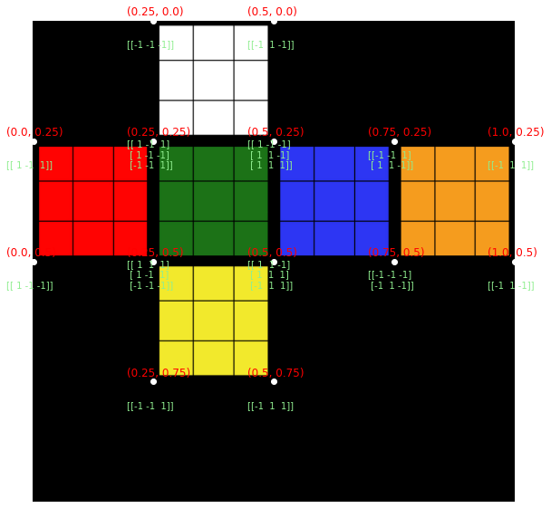

```python
import numpy as np
import os
import matplotlib.pyplot as plt
from assets.meshes.objviewer import *
```

# Triangle Meshes
In order to save bandwidth and disk spaces, the goal is to represent a surface as a network of triangles that connect to one another through shared vertices and edges. 

## Mesh Topology (Manifold)
A 2D __manifold__ is a surface in which a small neighborhood around any point could be smoothed out into a bit of flat surface. 

To verify a 2D mesh, we check that 
 1. every edge is shared by exactly two triangles
 2. Every vertex has a single, complete loop of triangles around it 
 
Note that a mesh may not be closed, so that on the __boundaries__ of a mesh with relaxed requirements, we check that 
 1. Every edge is used by either one or two triangles.
 2. Every vertex connects to a single edge-connected set of triangles

## Mesh orientation
The orientation defines the "front/outside" and "back/inside" of a mesh. The front will have _counterclockwise_ order. A connected mesh is __consistently oriented__ if its triangles all agree on which side is front, or equivalently every pair of adjacent triangles is consistently oriented. 

## Indexed Meshes
The simplest way to store a geometry is to store $n$ vertices as
$$V = \{v_{0},..., v_{n-1}\}, v_i \in \mathbb R^3$$
and $m$ faces/meshes as 
$$F = \{F_{0}, ..., F_{m-1}\}, F_{m_1} = (i, j, k) \in \{0, ..., n-1\}^3$$
Note that $i,j,k$ can also define the orientation of the mesh triangles

## Texture Mapping 
Texture mapping is a process of mapping image information onto a surface, i.e. 
$$T:\mathbb R^2 \rightarrow \mathbb R^3$$
Note that a flat surface is very easy to map (as a bilinear interpolation).

## `.obj` Files
<a href="https://en.wikipedia.org/wiki/Wavefront_.obj_file">Wiki link</a>

__Geometric vertex__  
A vertex can be specified in a line starting with the letter v. That is followed by $(x,y,z[,w])$ coordinates. $W$ is optional and defaults to 1.0. 
```
# List of geometric vertices, with (x, y, z [,w]) coordinates, w is optional and defaults to 1.0.
v 0.123 0.234 0.345 1.0
v ...
...
```

__Parameter space vertices__  
A free-form geometry statement can be specified in a line starting with the string vp. Define points in parameter space of a curve or surface. u only is required for curve points, u and v for surface points and control points of non-rational trimming curves, and u, v and w (weight) for control points of rational trimming curves.

```
# Parameter space vertices in ( u [,v] [,w] ) form; free form geometry statement ( see below )
vp 0.310000 3.210000 2.100000
vp ...
...
```

__Face elements__  
Faces are defined using lists of vertex, texture and normal indices in the format vertex_index/texture_index/normal_index for which each index starts at 1 and increases corresponding to the order in which the referenced element was defined. Polygons such as quadrilaterals can be defined by using more than three indices.

OBJ files also support free-form geometry which use curves and surfaces to define objects, such as NURBS surfaces.

__Vertex indices__  
A valid vertex index matches the corresponding vertex elements of a previously defined vertex list. If an index is positive then it refers to the offset in that vertex list, starting at 1. If an index is negative then it relatively refers to the end of the vertex list, -1 referring to the last element.

Each face can contain three or more vertices.

__Vertex texture coordinate indices__
Optionally, texture coordinate indices can be used to specify texture coordinates when defining a face. To add a texture coordinate index to a vertex index when defining a face, one must put a slash immediately after the vertex index and then put the texture coordinate index. No spaces are permitted before or after the slash. A valid texture coordinate index starts from 1 and matches the corresponding element in the previously defined list of texture coordinates. Each face can contain three or more elements.

__Vertex normal indices__
Optionally, normal indices can be used to specify normal vectors for vertices when defining a face. To add a normal index to a vertex index when defining a face, one must put a second slash after the texture coordinate index and then put the normal index. A valid normal index starts from 1 and matches the corresponding element in the previously defined list of normals. Each face can contain three or more elements.

```
# List of texture coordinates, in (u, [,v ,w]) coordinates, these will vary between 0 and 1. v, w are optional and default to 0.
vt 0.500 1 [0]
vt ...
...
# List of vertex normals in (x,y,z) form; normals might not be unit vectors.
vn 0.707 0.000 0.707
vn ...
...

# Polygonal face element
f 1 2 3
f 3/1 4/2 5/3
f 6/4/1 3/5/3 7/6/5
f 7//1 8//2 9//3
f ...
...
```


__Line element__
Records starting with the letter "l" specify the order of the vertices which build a polyline.
```
l 5 8 1 2 4 9
```


```python
def write_obj(V, F, UV, UF, NV, NF, filename:str):
    """
    Write a triangle or quad mesh to a .obj file
    
    V:  #V by 3 numpy array of vertex positions
    F:  #F by poly=(3 or 4) numpy array of mesh face indices into V
    UV  #UV by 2 numpy array of UV positions
    UF  #F by poly numpy array of mesh face indices into UV
    NV  #F by 3 numpy array of normal vectors
    NF  #NV by poly numpy array of mesh face indices into NV
    """
    if not filename.endswith(".obj"):
        raise NotImplementedError("File extension not supported")
        
    with open(filename, "w") as f:
        for i in range(V.shape[0]):
            f.write(f"v {V[i, 0]} {V[i, 1]} {V[i, 2]}\n")
        for i in range(UV.shape[0]):
            f.write(f"vt {UV[i, 0]} {UV[i, 1]}\n")
        for i in range(NV.shape[0]):
            f.write(f"vn {NV[i, 0]} {NV[i, 1]} {NV[i, 2]}\n")
        for i in range(F.shape[0]):
            f.write("f")
            for j in range(F.shape[1]):
                f.write(f" {F[i,j]+1}/{UF[i,j]+1}/{NF[i,j]+1}")
            f.write("\n")
```


```python
# Example of a cube
def cube():
    # The 8 vertices
    V = np.array([
        [1, -1, 1], [-1, -1, 1], [-1, 1, 1], [1, 1, 1], 
        [1, 1, -1], [-1, 1, -1], [-1, -1, -1], [1, -1, -1]])
    # The 6 faces
    F = np.array([
        [0, 7, 4, 3], [0, 3, 2, 1], [1, 2, 5, 6],
        [7, 6, 5, 4], [3, 4, 5, 2], [0, 1, 6, 7]
    ])
    
    # 14 points on the cube
    UV = np.array([
        [0.  , 0.25], [0.25, 0.25], [0.25, 0.  ], [0.5 , 0.  ],
        [0.5 , 0.25], [0.75, 0.25], [1.  , 0.25], [1.  , 0.5 ],
        [0.75, 0.5 ], [0.5 , 0.5 ], [0.5 , 0.75], [0.25, 0.75],
        [0.25, 0.5 ], [0.  , 0.5 ]
    ])
    
    # Map the 14 UV points onto the endpoints of the face
    UF = np.array([
        [ 1,  4,  9, 12], [12,  9, 10, 11], [ 5,  6,  7,  8],
        [ 1,  2,  3,  4], [ 4,  5,  8,  9], [ 0,  1, 12, 13]
    ])
    
    # The normal direction of each face
    NV = np.array([
        [ 1,  0,  0], [ 0,  0,  1], [-1,  0,  0], 
        [ 0,  0, -1], [ 0,  1,  0], [ 0, -1,  0]
    ])
    
    # The index the NV for the vertex normal
    NF = np.arange(6).reshape(6, 1).repeat(4, 1)
    return V, F, UV, UF, NV, NF
```


```python
V, F, UV, UF, NV, NF = cube()
texture = plt.imread("./assets/meshes/rubiks-cube.png")[::-1, :]
plt.figure(figsize=(10, 10))
plt.imshow(texture)
plt.scatter(UV[:, 0]* texture.shape[0], UV[:, 1]* texture.shape[1], color="white")
for i in range(UV.shape[0]):
    x, y = UV[i]
    plt.text(x * texture.shape[0] - 50, y * texture.shape[1] - 10, rf"({x}, {y})", color="red", fontsize=12)
c = {}
for i in range(UF.shape[0]):
    for j in range(UF.shape[1]):
        x, y = UV[UF[i, j]]
        if not c.get((x, y)):
            c[(x, y)] = []
        c[(x, y)].append(V[F[i, j]])
for (x, y), xyzs in c.items():
    text = str(np.vstack(xyzs))
    plt.text(x * texture.shape[0] - 50, y * texture.shape[1] + 50, text, color="#90ee90", fontsize=10)
plt.axis("off");
```


    

    


```python
write_obj(V, F, UV, UF, NV, NF, filename="./assets/meshes/cube.obj")
OBJViewer(name="cube", texture="./assets/meshes/rubiks-cube.png", obj = "./assets/meshes/cube.obj")
```


<div class="row">
<div class="col">
<canvas id="cube" style="height:100%; width:60%; display:block"></canvas>
</div>
</div>


### Sphere Mapping
Note that a sphere centered at $c = (c_x, c_y, c_z)$ and radius $r$ can be represented as the image of 
$$S:\mathbb  [0, 2\pi) \times [0, \pi]\rightarrow \mathbb R^3:= (\theta, \phi) = c + r(\sin\phi\cos\theta, \sin\phi\sin\theta, \cos\phi)$$
Therefore, we can sample evenly take $u\times v$ values from the domain


```python
num_faces_u = 15
num_faces_v = 15

def sphere(num_faces_u, num_faces_v):
    thetas = np.tile(np.linspace(0, 2 * np.pi, num_faces_u+1), num_faces_v)[:, None]
    phis = np.repeat(np.linspace(0, np.pi, num_faces_v), num_faces_u+1)[:, None]

    V = np.hstack([
        np.sin(phis) * np.cos(thetas),
        np.sin(thetas) * np.sin(phis),
        np.cos(phis)
    ])
    
    f_base = np.tile(np.arange(1, num_faces_u+1), num_faces_v)
    f_base = f_base + (num_faces_v)* np.repeat(np.arange(num_faces_v), num_faces_u)
    
    F = np.hstack([
        f_base[:, None], 
        f_base[:, None] + 1, 
        f_base[:, None] + num_faces_u + 1, 
        f_base[:, None] + num_faces_u
    ])

    UV = np.hstack([
        np.tile(np.linspace(0, 1, num_faces_u+1), num_faces_v)[:, None],
        np.repeat(np.linspace(0, 1, num_faces_u+1), num_faces_v)[:, None]
    ])

    UF = F

    NF = np.tile(np.arange(num_faces_u * (num_faces_v))[:, None], (1, 4))

    thetas_N = np.tile(np.linspace(0, 2 * np.pi, num_faces_u+1)[:-1], num_faces_v)[:, None]
    phis_N = np.repeat(np.linspace(0, np.pi, num_faces_v), num_faces_u)[:, None]

    # We approx the normal by the top left vertex
    NV = np.hstack([
        np.sin(phis_N) * np.cos(thetas_N),
        np.sin(thetas_N) * np.sin(phis_N),
        np.cos(phis_N)
    ])
    return V, F, UV, UF, NV, NF
```


```python
V, F, UV, UF, NV, NF = sphere(100, 100)
write_obj(V, F, UV, UF, NV, NF, filename="./assets/meshes/sphere.obj")
OBJViewer(name="sphere", texture="./assets/meshes/earth-square.png", obj = "./assets/meshes/sphere.obj")
```


<div class="row">
<div class="col">
<canvas id="sphere" style="height:100%; width:60%; display:block"></canvas>
</div>
</div>


```python
render()
```


<script type="module">
  import * as THREE from 'https://unpkg.com/three/build/three.module.js';
  import { OrbitControls } from 'https://unpkg.com/three/examples/jsm/controls/OrbitControls.js';
  import { OBJLoader } from 'https://unpkg.com/three/examples/jsm/loaders/OBJLoader.js';

  const OBJViewer = (canvas, obj_file, texture_img) => {
    const renderer = new THREE.WebGLRenderer({ canvas });
    const camera = new THREE.PerspectiveCamera(45, 2, 0.1, 100);
    camera.position.set(0, 0, 5);

    const controls = new OrbitControls(camera, canvas);
    controls.target.set(0, 0, 0);
    controls.update();

    const scene = new THREE.Scene();
    scene.background = new THREE.Color('white');

    const textureLoader = new THREE.TextureLoader();
    const texture = textureLoader.load(texture_img)

    {
      const skyColor = 0xB1E1FF;  // light blue
      const groundColor = 0xB97A20;  // brownish orange
      const intensity = 1;
      const light = new THREE.HemisphereLight(skyColor, groundColor, intensity);
      scene.add(light);
    }

    {
      const color = 0xFFFFFF;
      const intensity = 1;
      const light = new THREE.DirectionalLight(color, intensity);
      light.position.set(0, 10, 0);
      light.target.position.set(-5, 0, 0);
      scene.add(light);
      scene.add(light.target);
    }


    const objLoader = new OBJLoader();
    objLoader.load(obj_file, (root) => {
      root.traverse(function (child) {
        if (child.isMesh) child.material.map = texture;
      });
      scene.add(root);
    });

    function resizeRendererToDisplaySize(renderer) {
      const canvas = renderer.domElement;
      const width = canvas.clientWidth;
      const height = canvas.clientHeight;
      const needResize = canvas.width !== width || canvas.height !== height;
      if (needResize) {
        renderer.setSize(width, height, false);
      }
      return needResize;
    }

    function render() {

      if (resizeRendererToDisplaySize(renderer)) {
        const canvas = renderer.domElement;
        camera.aspect = canvas.clientWidth / canvas.clientHeight;
        camera.updateProjectionMatrix();
      }

      renderer.render(scene, camera);

      requestAnimationFrame(render);
    }

    requestAnimationFrame(render);
  }

  OBJViewer(document.querySelector("#cube"), "./assets/meshes/cube.obj", "./assets/meshes/rubiks-cube.png");

  OBJViewer(document.querySelector("#sphere"), "./assets/meshes/sphere.obj", "./assets/meshes/earth-square.png");

</script>

