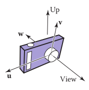
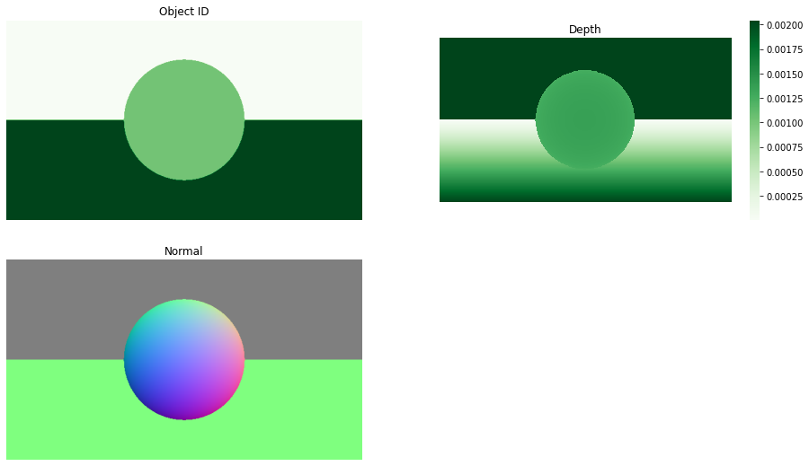
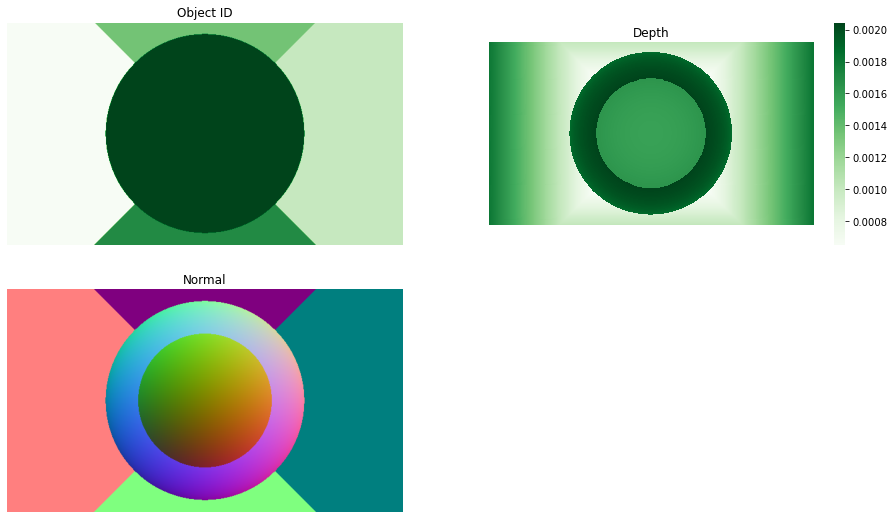
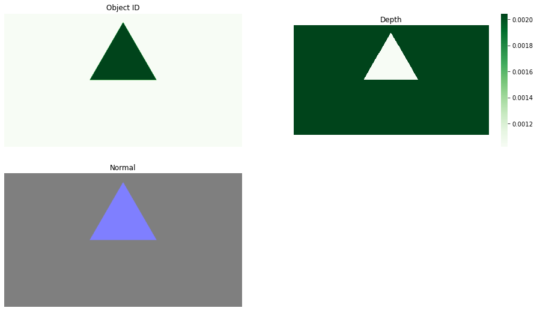
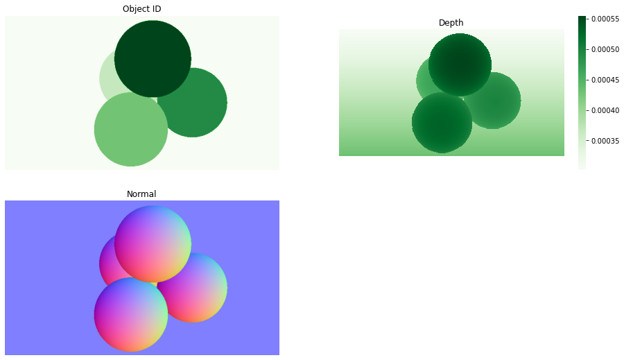

```python
import cv2, json
import numpy as np
import matplotlib.pyplot as plt
import seaborn as sn
```


```python
# helper functions

def read_json(file_name):
    with open(file_name, "r") as f:
        data = json.load(f)
        camera, objects = data['camera'], data['objects']
        camera = Camera(**camera)
        objs = []
        for obj in objects:
            if obj['type'] == 'plane':
                objs.append(Plane(p=obj['point'], n=obj['normal']))
            elif obj['type'] == 'sphere':
                objs.append(Sphere(r=obj['radius'], c=obj['center']))
            elif obj['type'] == 'triangle':
                objs.append(Triangle(obj['corners']))
        return camera, objs
            
def normalize(vec):
    return vec / np.linalg.norm(vec)

def visualize(id_map, depth, normal):
    plt.figure(figsize=(16, 9))
    plt.subplot(221); plt.axis("off"); plt.title("Object ID")
    plt.imshow(id_map, cmap="Greens")
    plt.subplot(222); plt.axis("off"); plt.title("Depth")
    sn.heatmap(depth, cmap="Greens", square=True)
    plt.subplot(223); plt.axis("off"); plt.title("Normal")
    plt.imshow((normal + 1) / 2)
```

# Viewing Rays

The 3D parametric line from the eye $e\in\mathbb R^3$ to a point $s\in\mathbb R^3$ is 
$$p(t) = e + t(s-e) = e+td$$
We advance from $e$ along the vector $s-e$ a fractional distance $t$ to find the point $p$.  
$e$ is the ray's origin and $d = s-e$ is the ray's direction. 

## Basic Setup

Given a camera frame $e$, i.e. the eye point or view point, and $u, v, w$ for the basis. Where $-w = view$, $u$ points rightward from the $view$ and $v$ points upward from the $view$. 



The viewing rays should start on the plane defined by the point e and the vectors u and v; the only remaining information required is where on the plane the image is supposed to be. We'll define the image dimensions with four numbers,
for the four sides of the image: l and r are the positions of the left and right
edges of the image, as measured from e along the u direction; and b and t are the
positions of the bottom and top edges of the image, as measured from e along the
$v$ direction. Usually $l < 0 < r$ and $b < 0 < t$.

Therefore, the pixel at $(i,j)$ in the raster image has the position 
$$u = l + (r-l)(i+0.5) / n_x, v = b + (t-b)(j + 0.5) / n_y$$

## Orthographic Views
For an orthographic view, the ray's origin is generated from the image and are parallel with each other. Therefore, given $u,v$
$$d_{ray} = -w, e_{ray} = e + u\vec u + v\vec v$$

## Perspective Views
For an perspective view, the ray's origin is the camera origin and rays have different directions. Therefore, given $u,v$
$$d_{ray} = -d\vec w + u\vec u + v\vec v, e_{ray} = e$$


```python
# Camera stores all the required parameters 
class Camera:
    def __init__(self, 
                 eye, 
                 up, look, 
                 focal_length, 
                 height, width, 
                 type):
        """
        e:             eye / viewing point
        up:            the upward direction of the view
        look:          the viewing direction
        d:             image plane distance / focal length
        height, width: width and height of image plane
        type:          perspective or orthographic
        """
        
        self.e = np.array(eye)
        self.v = normalize(np.array(up))
        self.w = normalize(-np.array(look))
        self.u = np.cross(self.v, self.w)
        self.d, self.height, self.width = focal_length, height, width
        self.type = type


def generate_ray_map_perspective(camera, width, height):
    """
    Generate a width * height * 3 array
    where each (i, j) is the direction of the viewing ray
    """
    ray_map = np.empty((width, height, 3))
    i = np.arange(width)
    j = np.arange(height)
    u = camera.width * (i + 0.5) / width - camera.width / 2
    v = camera.height / 2 - camera.height * (j + 0.5) / height
    vv, uu = np.meshgrid(v, u)
    ray_map[:, :, 0] = uu * camera.u[0] + vv * camera.v[0] - camera.d * camera.w[0]
    ray_map[:, :, 1] = uu * camera.u[1] + vv * camera.v[1] - camera.d * camera.w[1]
    ray_map[:, :, 2] = uu * camera.u[2] + vv * camera.v[2] - camera.d * camera.w[2]
    return ray_map, np.tile(camera.e, (width, height, 1))
```

# Ray Object Intersection
We need to find the closest intersection to the camera along the ray. 

For a ray $p:\mathbb R\rightarrow \mathbb R^3, p(t):= e+td$ and an implicit surface $\{p: \mathbb R^3: f(p) = 0\}$, we'd like to know the intersections. The intersected points occurs when 
$$f(p(t)) = 0$$
i.e. the points on the ray belongs to the set of points on the surface. 


```python
# The abstract class for different types of object-ray intersection
class Object:
    def intersect(self, ray_d, ray_e, min_t):
        """ return t and normal maps
        of the intersection, if not intersect, 
        then the position will have NaN
        """
        raise NotImplementedError
```

## Sphere
A sphere is represented by a center $c= (x_c, y_c, z_c)$ and radius $R$, where 
$$f(p) = \|p-c\|^2-R^2_2$$
so we can plug in $p=e+td$ and obtain the equation 
$$\|e+td-c\|^2-R^2_2 = 0$$
Note that this is a quadratic function about $t$, i.e. 
$$\|d\|^2_2 t^2 + 2d^T(e-c)t + \|e-c\|_2^2 - R^2 = 0$$
let $A = \|d\|^2_2, B = 2d^T(e-c), C = \|e-c\|_2^2 - R^2$,   
Note that a ray must have two points intersect with a sphere, one point going inside and one going outside.  
Therefore, we need $B^2 - 4AC > 0$ and 
$$t = \frac{-B \pm \sqrt{B^2 - 4AC}}{2A}$$
And the normal vector and unit normal at $p$ is 
$$n = \nabla f(p) = 2(p-c), \hat n = (p-c) / R$$


```python
class Sphere(Object):
    def __init__(self, c, r):
        """
        c: center of the sphere
        r: radius
        """
        self.c = np.array(c)
        self.r = r
        
    def intersect(self, ray_d, ray_e, min_t):
        if len(ray_e.shape) == 1:
            ray_e = np.tile(ray_e, list(ray_d.shape[:2]) + [1])
        c_map = self.c[None, None, :]
        A = ray_d[:, :, 0] * ray_d[:, :, 0] + \
            ray_d[:, :, 1] * ray_d[:, :, 1] + \
            ray_d[:, :, 2] * ray_d[:, :, 2]
        B = 2 * (ray_d[:, :, 0] * (ray_e - c_map)[:, :, 0] + \
                 ray_d[:, :, 1] * (ray_e - c_map)[:, :, 1] + \
                 ray_d[:, :, 2] * (ray_e - c_map)[:, :, 2])
        C =  (ray_e - c_map)[:, :, 0] ** 2 + \
             (ray_e - c_map)[:, :, 1] ** 2 + \
             (ray_e - c_map)[:, :, 2] ** 2 - self.r ** 2
        
        discriminant = B * B - 4 * A * C
        sqrt_dis = np.sqrt(discriminant, 
                           where=discriminant > 0)
        t1 = (- B + sqrt_dis) / (2 * A)
        t2 = (- B - sqrt_dis) / (2 * A)
        
        t = t1
        t[discriminant < 0] = np.nan
        with np.errstate(invalid='ignore'):
            t[(t1 < min_t) & (t2 < min_t)] = np.nan
            t[(t2 < t1) & (t2 >= min_t)] = t2[(t2 < t1) & (t2 >= min_t)]
        n = ray_e + \
            np.repeat(t[:, :, np.newaxis], 3, axis=2) * ray_d - \
            c_map
        n /= self.r
        return t, n
```

## Plane
A plane can be represented by an arbitrary point $p_0$ and its normal $n$ as $f(p) = (p-p_0)\cdot n$ since any vector lies on the plane should be perpendicular to the plane's normal. Therefore, we want to solve 
$$(e+td - p_0)\cdot n = 0$$
i.e. 
$$t = \frac{(p_0 - e)^T n}{d^Tn}$$
and the normal is just $\hat n = n/\|n\|$


```python
class Plane(Object):
    def __init__(self, p, n):
        """
        p: an arbitrary point on the plane
        n: the normal of the plane
        """
        self.p = np.array(p)
        self.n = np.array(n)
    
    def intersect(self, ray_d, ray_e, min_t):
    
        # dot product of each ray_direction and normal
        denom = ray_d[:, :, 0] * self.n[0] + \
                ray_d[:, :, 1] * self.n[1] + \
                ray_d[:, :, 2] * self.n[2]
        p_map = self.p[None, None, :]
        t = (p_map - ray_e)[:, :, 0] * self.n[0] + \
            (p_map - ray_e)[:, :, 1] * self.n[1] + \
            (p_map - ray_e)[:, :, 2] * self.n[2] 
        t = t / denom
        t[t < min_t] = np.nan
        n = np.tile(normalize(self.n), list(t.shape) + [1])
        return t, n   
```

## Triangle
Triangle can be represented with 3 vertices $a, b,c$, or the 3 corners.  
One way of implementing triangle intersection is to find the intersection point $p=e+td$ with the plane that the triangle lines on and then decide whether the point is within the triangle. However, we can also use barycentric coordinates where we solves 
$$e + td = a + \beta(b-a) + \gamma(c-a)$$
$$\begin{bmatrix}
x_a - x_b&x_a-x_c &x_d\\
y_a - y_b&y_a-y_c &y_d\\
z_a - z_b&z_a-z_c &z_d
\end{bmatrix}\begin{bmatrix}\beta\\\gamma\\t\end{bmatrix} = \begin{bmatrix}x_a-x_e\\y_a-y_e\\z_a-z_e\end{bmatrix}$$
if exists such $t, \beta, \gamma >0, \beta + \gamma < 1$, then there is an intersection.  
Then, the easiest way to solve such $3\times 3$ matrix is to use Cramer's rule.   
For $Ax = b$ where $A$ is $n\times n$ matrix, denote $A_i = A$ with the $i$th column being replaced by $b$, so that $x_i = \det(A_i) / \det(A)$. 

The normal is the plane's normal, i.e. can be obtained by any two vector's cross product. 


```python
class Triangle(Object):
    def __init__(self, corners):
        self.corners = np.array(corners)
    
    def intersect(self, ray_d, ray_e, min_t):
        
        abc = self.corners[0] - self.corners[1]
        def_ = self.corners[0] - self.corners[2]
        jkl = self.corners[0][None, None, :] - ray_e
        
        def_x_ghi = np.cross(def_, ray_d)
        M = abc[0] * def_x_ghi[:, :, 0] + \
            abc[1] * def_x_ghi[:, :, 1] + \
            abc[2] * def_x_ghi[:, :, 2] 
        
        abc_x_jkl = np.cross(abc, jkl)
        
        time =  - (def_[0] * abc_x_jkl[:, :, 0] + \
                def_[1] * abc_x_jkl[:, :, 1] + \
                def_[2] * abc_x_jkl[:, :, 2] ) / M
        
        gamma = (ray_d[:, :, 0] * abc_x_jkl[:, :, 0] + \
                 ray_d[:, :, 1] * abc_x_jkl[:, :,1] + \
                 ray_d[:, :, 2] * abc_x_jkl[:, :, 2] ) / M
        
        beta = (jkl[:, :, 0] * def_x_ghi[:, :, 0] + \
                jkl[:, :, 1] * def_x_ghi[:, :, 1] + \
                jkl[:, :, 2] * def_x_ghi[:, :, 2] ) / M
        
        t = time
        t[(time < min_t) | \
          (gamma < 0) | (gamma > 1) | \
          (beta < 0) | (beta > 1) | \
          (beta + gamma > 1)] = np.nan
        
        n = normalize(np.cross(abc, def_))
        return t, n
```

## Intersecting a group of objects
Finally, given a group of objects, we only need to find the first hit object, as it will block all the other objects (assuming no transparency for any objects)


```python
def first_hit(camera, ray_d, ray_e, min_t, objects):
    """ Compute the first intersection for each ray direction
    returns the id, depth, and normal maps
    
    ray_d:   the direction map of the ray
    ray_e:   the origin of the rays
    min_t:   the minimal t to consider
    objects: a list of objects to consider
    """
    t = np.zeros(list(ray_d.shape[:2]) + [len(objects)+1]) + np.inf
    n = np.zeros(list(ray_d.shape[:2]) + [len(objects)+1, 3])
    
    for i, obj in enumerate(objects, start=1):
        t[:, :, i], n[:, :, i, :] = obj.intersect(ray_d, ray_e, min_t)
    
    depth = np.nanmin(t, axis=2)
    depth[depth == np.inf] = min_t
    depth = camera.d / (depth * np.linalg.norm(ray_d))
    id_map = np.nanargmin(t, axis=2)
    
    normal = np.empty(list(id_map.shape) + [3])
    for i in range(normal.shape[0]):
        for j in range(normal.shape[1]):
            normal[i, j, :] = n[i, j, id_map[i, j], :]
    return (np.swapaxes(id_map, 1, 0), 
            np.swapaxes(depth, 1, 0), 
            np.swapaxes(normal, 1, 0))
```


```python
camera, objects = read_json("./assets/sphere-and-plane.json")
ray_d, ray_e = generate_ray_map_perspective(camera, 640, 360)

id_map, depth, normal = first_hit(camera, ray_d, ray_e, 1, objects)
visualize(id_map, depth, normal)
```


    

    


```python
camera, objects = read_json("./assets/inside-a-sphere.json")
ray_d, ray_e = generate_ray_map_perspective(camera, 640, 360)

id_map, depth, normal = first_hit(camera, ray_d, ray_e, 1, objects)
visualize(id_map, depth, normal)
```


    

    


```python
camera, objects = read_json("./assets/triangle.json")
ray_d, ray_e = generate_ray_map_perspective(camera, 640, 360)

id_map, depth, normal = first_hit(camera, ray_d, ray_e, 1, objects)
visualize(id_map, depth, normal)
```


    

    


```python
camera, objects = read_json("./assets/sphere-packing.json")
ray_d, ray_e = generate_ray_map_perspective(camera, 640, 360)

id_map, depth, normal = first_hit(camera, ray_d, ray_e, 1, objects)
visualize(id_map, depth, normal)
```


    

    

