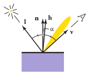

```python
# import what is inside ray casting notebook
# and adjust some different part to fit for the task
from assets.raycasting import *

def first_hit(ray_d, ray_e, min_t, objects):
    """ Compute the first intersection for each ray direction
    returns the id, depth, and normal maps
    
    ray_d:   the direction map of the ray
    ray_e:   the origin of the rays
    min_t:   the minimal t to consider
    objects: a list of objects to consider
    """
    t = np.zeros(list(ray_d.shape[:2]) + [len(objects)+1]) + np.inf
    n = np.zeros(list(ray_d.shape[:2]) + [len(objects)+1, 3])
    
    for i, obj in enumerate(objects, start=1):
        t[:, :, i], n[:, :, i, :] = obj.intersect(ray_d, ray_e, min_t)
    
    depth = np.nanmin(t, axis=2)
    depth[depth == np.inf] = min_t
    id_map = np.nanargmin(t, axis=2)
    
    normal = np.empty(list(id_map.shape) + [3])
    for i in range(normal.shape[0]):
        for j in range(normal.shape[1]):
            normal[i, j, :] = n[i, j, id_map[i, j], :]
    return id_map, depth, normal

def read_json(file_name):
    with open(file_name, "r") as f:
        data = json.load(f)
        camera, objects = data['camera'], data['objects']
        camera = Camera(**camera)
        
        lights = []
        for light in data['lights']:
            if light['type'] == "point":
                lights.append(PointLight(light['color'], 
                                         light['position']))
            elif light['type'] == "directional":
                lights.append(DirectionalLight(light['color'], 
                                               light['direction']))
        materials = []
        for material in data['materials']:
            materials.append(Material(**material))
            
        objs = []
        for obj_json in objects:
            if obj_json['type'] == 'plane':
                obj = Plane(p=obj_json['point'], n=obj_json['normal'])
            elif obj_json['type'] == 'sphere':
                obj = Sphere(r=obj_json['radius'], c=obj_json['center'])
            elif obj_json['type'] == 'triangle':
                obj = Triangle(obj_json['corners'])
            else:
                raise NotImplementedError
            material = [m for m in materials if m.name == obj_json['material']]
            if len(material) == 0:
                raise ValueError
            obj.add_material(material[0])
            objs.append(obj)
        return camera, objs, lights
```

# Shading 
Simple shading models are defined in terms of illumination from a point light source.  
Given  
-  light direction $l$ as a unit vector pointing towards the light source; 
-  view direction $v$ as a unit vector pointing toward the camera; 
-  the surface normal $n$ as a unit vector perpendicular to the surface at the point where reflection takes place. 
- characteristics of the surface, mostly as coefficients 


```python
class Material:
    """ Material model that stores all the 
    characteristics for the surface
    """
    def __init__(self, name, ka, kd, ks, km, phong_exponent):
        self.ka = np.array(ka)
        self.kd = np.array(kd)
        self.ks = np.array(ks)
        self.km = np.array(km)
        self.p = phong_exponent
        self.name = name
    
class Light:
    """ Light model that stores the light direction
    """
    def __init__(self, I):
        """
        I: the color intensities of the light
        """
        self.I = np.array(I)
    
    def direction(self, q):
        """ Given a query point, return the 
        direction toward the light
        """
        raise NotImplementedError

class PointLight(Light):
    def __init__(self, I, p):
        """
        I: the color intensities of the light
        d: Direction from light toward scene.
        """
        self.I, self.p = np.array(I), np.array(p)
        
    def direction(self, q):
        p_map = np.tile(((self.p)[None, None, :]), 
                        list(q.shape[:2]) + [1])
        return p_map - q, np.linalg.norm(p_map - q, axis=2)

class DirectionalLight(Light):
    
    def __init__(self, I, d):
        """
        I: the color intensities of the light
        d: Direction from light toward scene.
        """
        self.I, self.d = np.array(I), np.array(d)
        
    def direction(self, q):
        return (-np.tile(self.d[None, None, :], 
                        list(q.shape[:2]) + [1]), 
                np.zeros(q.shape[:2]) + np.infty)
```


```python
def construct_coefficient_map(objs, id_map):
    shape = list(id_map.shape) + [3]
    kd = np.zeros(shape)
    ka = np.zeros(shape)
    ks = np.zeros(shape)
    km = np.zeros(shape)
    phong_exponent = np.zeros(id_map.shape)
    for i in range(shape[0]):
        for j in range(shape[1]):
            if id_map[i, j] == 0:
                continue
            kd[i, j, :] = objs[id_map[i, j] - 1].material.kd
            ka[i, j, :] = objs[id_map[i, j] - 1].material.ka
            ks[i, j, :] = objs[id_map[i, j] - 1].material.ks
            km[i, j, :] = objs[id_map[i, j] - 1].material.km
            phong_exponent[i, j] = objs[id_map[i, j] - 1].material.p
    return kd, ka, ks, km, phong_exponent


def bl_shading(ray_d, ray_e, 
               objs, lights, 
               id_map, t, n, 
               components):
    """ Given a ray map, return the RGB color
    ray_d, ray_e: the ray map
    objs:         a list of Objects
    lights:       a list of Lights
    """
    p = ray_e + t[:, :, None] * ray_d
    
    rgb = np.zeros(n.shape)
    kd, ka, ks, km, phong_exponent = construct_coefficient_map(objs, id_map)
    
    rgb = np.zeros(n.shape)
    if 'ambient' in components:
        rgb += ambient(ka, .1)
        
    for light in lights:
        rgb_light = np.zeros(rgb.shape)
        l, max_t = light.direction(p)
        l = l / np.linalg.norm(l, axis=2)[:,:,None]
        I = light.I
        if "diffuse" in components:
            rgb_light += diffuse(l, n, kd, I)
        if 'specular' in components:
            rgb_light += specular(l, n, ray_d, ka, I, phong_exponent)
        if 'shadow' in components:
            mask = shadow(p, l, objs, max_t)
            rgb_light[~mask] = 0
        rgb += rgb_light
    return rgb
```


```python
camera, objects, lights = read_json("./assets/sphere-and-plane.json")
ray_d, ray_e = generate_ray_map_perspective(camera, 640, 360)
components = []
id_map, t, n = first_hit(ray_d, ray_e, 1, objects)
```

## Ambient Shading
To make sure surfaces that receives no illumination at all should have somewhat color, we add an ambient light $k_a I_a$, where $k_a$ is the surface's ambient coefficient and $I_a$ as the ambient light intensity. 


```python
def ambient(ka, Ia):
    return ka * Ia
```


```python
components.append('ambient')
color = bl_shading(ray_d, ray_e, 
                   objects, lights, 
                   id_map, t, n,
                   components)
plt.imshow(np.swapaxes(color.clip(0, 1), 0, 1))
plt.axis("off");
```


    

    


## Lambertian Shading (Diffuse)


Using the property that a surface facing directly toward the light receives max illumination; while a surface tangent to the light direction receives no illumination, and in between is proportional to $\cos\theta, \theta$ is the angle between $l, n$.  
Then, the model is defined as 
$$L = k_d I\max(0, n\cdot l)$$
$k_d$ is the diffuse coefficient, or the surface color,   
$I$ is the light intensity  
$n\cdot l = \cos\theta$ since $n,l$ are unit vectors


```python
def diffuse(l, n, kd, I):
    nl = n[:, :, 0] * l[:, :, 0] + \
         n[:, :, 1] * l[:, :, 1] + \
        n[:, :, 2] * l[:, :, 2]
    nl[nl < 0] = 0
    return kd * I[None, None,:] * nl[:, :, None]
```


```python
components.append("diffuse")
color = bl_shading(ray_d, ray_e, 
                   objects, lights, 
                   id_map, t, n,
                   components)
plt.imshow(np.swapaxes(color.clip(0, 1), 0, 1))
plt.axis("off");
```


    

    


## Blinn-Phong Shading (Specular)


Lambertian shading is view independent: the color of a surface does not depend
on the direction from which you look. Many real surfaces show some degree
of shininess, producing highlights, or specular reflections, that appear to move
around as the viewpoint changes.

BP shading's idea is to produce reflection that is at its brightest
when v and l are symmetrically positioned across the surface normal, which is
when mirror reflection would occur; the reflection then decreases smoothly as the
vectors move away from a mirror configuration.

We can tell how close we are to a mirror configuration by comparing the
half vector $h$ (the bisector of the angle between $v$ and $l$) to the surface normal. If the half vector is near the surface normal, the specular component
should be bright; if it is far away it should be dim.

The half vector $h$ is calcualted as 
$$h = \frac{v+l}{\|v+l\|}$$
and the shading model is  
$$L = k_d I \max(0, n\cdot l) + k_s I \max(0, n\cdot h)^p$$
$k_s$ is the specular coefficient  
$p$ adjust how "shiny" the effect is


```python
def specular(l, n, ray_d, ka, I, p):
    h = l - ray_d / ((np.linalg.norm(ray_d, axis=2))[:, :, None])
    h = h / np.linalg.norm(h, axis=2)[:, :, None]
    nh = n[:, :, 0] * h[:, :, 0] + \
         n[:, :, 1] * h[:, :, 1] + \
         n[:, :, 2] * h[:, :, 2]
    nh[nh < 0] = 0
    nh = nh ** p
    return ka * I[None, None,:] * nh[:, :, None]
```


```python
components.append("specular")
color = bl_shading(ray_d, ray_e, 
                   objects, lights, 
                   id_map, t, n,
                   components)
plt.imshow(np.swapaxes(color.clip(0, 1), 0, 1))
plt.axis("off");
```


    

    


## Multiple Point Lights
With multiple lights, we simply have 
$$L = k_a I_a + \sum^N k_d I_i \max(0, n\cdot l_i) + k_s I_i\max(0, n\cdot h_i)^p$$

# Shadows
We simply check whether the light ray $p + tl$ hits any other objects, if hits, that means the light is blocked hence it is within shadow


```python
def shadow(ray_e_shadow, ray_d_shadow, objs, max_t):
    id_map_shadow, t_shadow, n_shadow = first_hit(ray_d_shadow, ray_e_shadow, 1e-7, objs)
    return (t_shadow > max_t) | (id_map_shadow == 0) | (max_t == np.infty)
```


```python
components.append('shadow')
color = bl_shading(ray_d, ray_e, 
                   objects, lights, 
                   id_map, t, n,
                   components)
plt.imshow(np.swapaxes(color.clip(0, 1), 0, 1))
plt.axis("off");
```


    

    


# Specular Reflection
When a viewer looking from a direction $e$ sees what is in direction $r$ as seen from the surface. The direction $r$ can be calculated as 
$$r = d - 2(d\cdot n) n$$
Therefore, we can have 
$$L' = L + k_m raycolor(p+sr)$$
where $L$ is from the original model, $s\in (\epsilon, \infty), \epsilon$ is a small error term in control of the numerical error, $k_m$ is the mirror reflection coefficient.


```python
def reflect(d, n):
    d_dot_n = d[:, :, 0] * n[:, :, 0] + \
              d[:, :, 1] * n[:, :, 1] + \
              d[:, :, 2] * n[: ,: ,2]
    r = d - 2 * d_dot_n[:, :, None] * n
    return r / (np.linalg.norm(r, axis=2)[:, :, None])

def raycolor(ray_d, ray_e, 
             min_t, 
             objs, lights, 
             components, 
             recurive_number):
    id_map, t, n = first_hit(ray_d, ray_e, min_t, objects)
    kd, ka, ks, km, phong_exponent = construct_coefficient_map(objs, id_map)
    rgb = bl_shading(ray_d, ray_e, 
                     objs, lights, 
                     id_map, t, n,
                     components)
    if recurive_number == 1:
        return rgb
    
    ray_e_reflect = ray_e + t[:, :, None] * ray_d
    
    ray_d_reflect = reflect(ray_d, n)
    return rgb + km * raycolor(ray_d_reflect, ray_e_reflect, 
                               1e-7, 
                               objs, lights, 
                               components, 
                               recurive_number - 1)
```


```python
#### components.append('shadow')
color = raycolor(ray_d, ray_e, 
                 1, 
                 objects, lights, 
                 components, 
                 5)
plt.imshow(np.swapaxes(color.clip(0, 1), 0, 1))
plt.axis("off");
```


    

    


```python
camera, objects, lights = read_json("./assets/two-spheres-and-plane.json")
ray_d, ray_e = generate_ray_map_perspective(camera, 640, 360)
color = raycolor(ray_d, ray_e, 
                 1, 
                 objects, lights, 
                 components, 
                 5)
plt.imshow(np.swapaxes(color.clip(0, 1), 0, 1))
plt.axis("off");
```


    

    


```python
camera, objects, lights = read_json("./assets/sphere-packing.json")
ray_d, ray_e = generate_ray_map_perspective(camera, 640, 360)
color = raycolor(ray_d, ray_e, 
                 1, 
                 objects, lights, 
                 components, 
                 5)
plt.imshow(np.swapaxes(color.clip(0, 1), 0, 1))
plt.axis("off");
```


    

    

